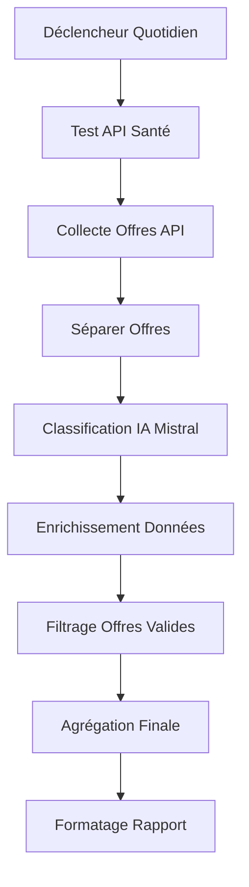

# Guide de Configuration n8n - Agent Alternance

## 📋 Résumé

Ce guide détaille la configuration complète de n8n pour le workflow d'automatisation de recherche d'offres d'alternance en cybersécurité, incluant l'intégration avec l'API Mistral pour l'analyse IA.

## 🚀 Prérequis

- Docker et Docker Compose installés
- Clé API Mistral valide
- API scraper démarrée sur le port 9555

## 📁 Structure du Projet

```
agent_n8n/
├── docker/
│   └── docker-compose.yml    # Configuration Docker n8n
├── config/
│   └── .env                  # Variables d'environnement
├── workflows/
│   └── workflow_api_scraper_simple.json  # Workflow corrigé
└── docs/
    └── GUIDE_CONFIGURATION_N8N.md  # Ce fichier
```

## 🔧 Configuration Step-by-Step

### 1. Configuration des Variables d'Environnement

Créez/modifiez le fichier `config/.env` :

```bash
# Configuration n8n
N8N_PORT=9678
N8N_BASIC_AUTH_ACTIVE=true
N8N_BASIC_AUTH_USER=admin
N8N_BASIC_AUTH_PASSWORD=admin123

# Configuration API
API_PORT=9555
API_HOST=0.0.0.0

# Clé API Mistral (OBLIGATOIRE pour l'analyse IA)
MISTRAL_API_KEY=votre_cle_api_mistral_ici

# Configuration optionnelle
LOG_LEVEL=INFO
CORS_ENABLED=true
```

### 2. Démarrage de n8n

```bash
# Depuis le répertoire agent_n8n/
cd docker
docker-compose up -d
```

n8n sera accessible sur : http://localhost:9678

### 3. Configuration des Credentials Mistral dans n8n

#### 3.1 Accéder à l'interface n8n

1. Ouvrez http://localhost:9678
2. Connectez-vous avec `admin` / `admin123`

#### 3.2 Créer les Credentials Mistral

1. **Cliquez sur "Settings" (⚙️) dans le menu principal**
2. **Sélectionnez "Credentials"**
3. **Cliquez sur "Add Credential"**
4. **Recherchez et sélectionnez "Mistral API"**

#### 3.3 Configuration du Credential

- **Name**: `MistralApi` (exactement ce nom)
- **API Key**: Collez votre clé API Mistral
- **Save** pour enregistrer

⚠️ **Important**: Le nom du credential doit être exactement `MistralApi` pour correspondre au workflow.

### 4. Importation du Workflow

#### 4.1 Import du Workflow

1. **Dans n8n, cliquez sur "Workflows"**
2. **Cliquez sur "Import" ou "+"**
3. **Sélectionnez "Import from file"**
4. **Choisissez le fichier** `workflows/workflow_api_scraper_simple.json`

#### 4.2 Vérification des Connexions

Le workflow importé devrait automatiquement :
- ✅ Utiliser le credential `MistralApi`
- ✅ Pointer vers l'API sur `host.docker.internal:9555`
- ✅ Avoir toutes les connexions entre nodes

## 🧪 Tests et Validation

### 1. Test Manuel du Workflow

1. **Ouvrez le workflow importé**
2. **Cliquez sur "Test workflow"**
3. **Observez l'exécution node par node**

### 2. Test Automatique

```bash
# Depuis la racine du projet
python agent_python/tests/test_workflow_n8n.py
```

### 3. Vérification des Nodes

#### Node "Test API Santé"
- ✅ URL: `http://host.docker.internal:9555/health`
- ✅ Status: 200
- ✅ Response JSON avec `service` et `endpoints`

#### Node "Collecte Offres API"
- ✅ URL: `http://host.docker.internal:9555/scrape-offres`
- ✅ Method: POST
- ✅ Content-Type: application/json
- ✅ Body JSON avec `termes`, `max_offres`, `sources`

#### Node "Classification IA Mistral"
- ✅ URL: `https://api.mistral.ai/v1/chat/completions`
- ✅ Authentication: Utilise credential `MistralApi`
- ✅ Model: `mistral-large-latest`
- ✅ Messages: Prompt de classification d'offres

## 🔗 Flux de Données



## 📊 Format des Données

### Structure Attendue par le Workflow

```json
{
  "success": true,
  "results": {
    "total_offres": 5,
    "offres": [
      {
        "title": "Alternance Cybersécurité",
        "company": "TechCorp",
        "location": "Paris (75)",
        "url": "https://example.com/offre/123",
        "description": "Description de l'offre...",
        "scraper_source": "pole_emploi"
      }
    ]
  }
}
```

### Réponse Mistral Attendue

```json
{
  "choices": [
    {
      "message": {
        "content": "VALIDE - Offre d'alternance en cybersécurité"
      }
    }
  ]
}
```

## 🔧 Dépannage

### Problème : "Credential not found"

**Solution** :
1. Vérifiez que le credential s'appelle exactement `MistralApi`
2. Vérifiez que la clé API Mistral est valide
3. Re-créez le credential si nécessaire

### Problème : "API not reachable"

**Solution** :
1. Vérifiez que l'API est démarrée : `python agent_n8n/api/api_scraper_pour_n8n.py --port 9555`
2. Testez la santé : `curl http://localhost:9555/health`
3. Vérifiez les ports dans docker-compose.yml

### Problème : "Mistral API error"

**Solution** :
1. Vérifiez votre clé API Mistral
2. Vérifiez votre quota/limite de taux Mistral
3. Testez manuellement : `curl -H "Authorization: Bearer YOUR_KEY" https://api.mistral.ai/v1/models`

### Problème : "Workflow execution failed"

**Solution** :
1. Vérifiez les logs de chaque node
2. Testez chaque endpoint individuellement
3. Vérifiez le format JSON des réponses

## 📅 Planification

Le workflow est configuré pour s'exécuter :
- **Fréquence** : Tous les jours ouvrés (lundi-vendredi)
- **Heure** : 9h00 du matin
- **Cron** : `0 9 * * 1-5`

Pour modifier la planification :
1. Éditez le node "Déclencheur Quotidien"
2. Modifiez l'expression cron
3. Sauvegardez le workflow

## 🚀 Mise en Production

### Checklist Pré-Production

- [ ] Tests unitaires API passent
- [ ] Test d'intégration n8n réussi
- [ ] Credentials Mistral configurés
- [ ] Planification configurée
- [ ] Logs et monitoring activés
- [ ] Variables d'environnement sécurisées

### Monitoring

- **Logs n8n** : Disponibles dans l'interface web
- **Logs API** : `logs/api_scraper_n8n.log`
- **Métriques** : Endpoint `/health` pour monitoring externe

---

## 📞 Support

**Auteur**: desmedt.franck@iaproject.fr
**Version**: 1.0
**Date**: 03/06/2025

Pour des questions ou problèmes, consultez les logs ou contactez l'équipe de développement.