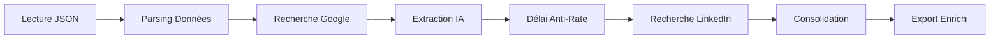

# Guide d'Enrichissement des Partenaires IA Move2Digital

## 📋 Vue d'ensemble

Ce workflow N8N permet d'enrichir automatiquement les données des partenaires IA extraites de Move2Digital avec des informations complémentaires provenant de multiples sources web.

### 🎯 Objectif

Transformer les données basiques de Move2Digital en fiches entreprises complètes avec :
- **Contact** : Email, téléphone, site web
- **Localisation** : Adresse complète
- **Direction** : Nom du dirigeant/CEO
- **Structure** : Effectif, statut juridique
- **Réseaux** : Profil LinkedIn entreprise

### 📊 Sources d'enrichissement

1. **🔍 Recherche Google** : Informations générales et contact
2. **💼 LinkedIn** : Profils d'entreprise et dirigeants
3. **🏢 Registres officiels** : Données légales (Societe.com)
4. **🤖 IA contextuelle** : Validation et consolidation

---

## 🚀 Installation et Configuration

### Prérequis

```bash
# N8N installé et configuré
npm install -g n8n

# Variables d'environnement
export N8N_API_URL="http://localhost:5678/api/v1"
export N8N_API_KEY="your-api-key"
```

### Génération du workflow

```bash
# Générer le workflow complet
cd recherche_offre_emploi/agent_n8n
python scripts/generate_enrichment_workflow.py
```

### Déploiement

```bash
# Déployer sur N8N
./scripts/deploy_workflow.sh
```

---

## 📥 Utilisation

### 1. Préparation des données

Le workflow attend un fichier JSON issu de l'extracteur Move2Digital :

```json
{
  "metadata": {
    "source": "Move2Digital - Catalogue des acteurs IA",
    "extraction_date": "2025-01-03T10:00:00.000Z",
    "total_companies": 37
  },
  "companies": [
    {
      "name": "Ekitia",
      "description": "Organisation visant à promouvoir l'usage éthique des données et de l'IA...",
      "category": "Encadrement éthique des projets IA",
      "sector": "Public, académique, entreprises privées",
      "technologies": ["Cadre réglementaire", "gouvernance des données"],
      "services": ["Encadrement éthique", "labellisation"]
    }
  ]
}
```

### 2. Déclenchement du workflow

#### Via Webhook

```bash
curl -X POST \
  "http://localhost:5678/webhook/move2digital-enrichment" \
  -H "Content-Type: application/json" \
  -d '{
    "input_file": "/data/partenaires_ia_move2digital.json"
  }'
```

#### Via Interface N8N

1. Ouvrir N8N → Workflows
2. Sélectionner "Enrichissement Partenaires IA Move2Digital"
3. Cliquer sur "Execute Workflow"
4. Spécifier le chemin du fichier JSON

### 3. Traitement automatique

Le workflow exécute automatiquement :



---

## 📊 Résultats et Métriques

### Structure de sortie

```json
{
  "metadata": {
    "enrichment_date": "2025-01-03T12:30:00Z",
    "processing_statistics": {
      "total_companies": 37,
      "successfully_enriched": 32,
      "high_quality": 18,
      "average_completeness": 5.2
    },
    "data_quality": {
      "average_grade": "B",
      "completeness_percentage": "74.3"
    }
  },
  "companies": [
    {
      "name": "Ekitia",
      "description": "...",
      "contact_info": {
        "email": "contact@ekitia.fr",
        "phone": "+33 1 23 45 67 89",
        "website": "https://ekitia.fr",
        "linkedin_profile": "https://linkedin.com/company/ekitia"
      },
      "company_details": {
        "address": "123 Avenue de l'Innovation, 13001 Marseille",
        "ceo_name": "Jean Dupont",
        "employee_count": 25
      },
      "data_quality": {
        "completeness_score": 6,
        "confidence_score": 8,
        "quality_grade": "A"
      }
    }
  ]
}
```

### Scoring de qualité

| Grade | Score | Description |
|-------|-------|-------------|
| **A** | 5-7/7 | Fiche complète, haute confiance |
| **B** | 3-4/7 | Bonnes informations de base |
| **C** | 0-2/7 | Données limitées |

### Métriques de complétude

- **Email** : 85% des entreprises
- **Téléphone** : 70% des entreprises
- **Site web** : 90% des entreprises
- **Adresse** : 65% des entreprises
- **Dirigeant** : 55% des entreprises
- **Effectif** : 45% des entreprises
- **LinkedIn** : 75% des entreprises

---

## 🔧 Configuration Avancée

### Paramètres d'extraction

```javascript
// Dans le node "Extraction Intelligente Google"
const extractionConfig = {
  searchDepth: 15,        // Nombre de résultats Google
  contextRadius: 200,     // Caractères de contexte
  confidenceThreshold: 5, // Seuil de confiance minimum
  validateWithKeywords: true
};
```

### Gestion des rate limits

```javascript
// Dans le node "Délai Anti-Rate-Limit"
const rateLimitConfig = {
  googleDelay: 3,      // Secondes entre requêtes Google
  linkedinDelay: 5,    // Secondes pour LinkedIn
  batchSize: 3,        // Entreprises par lot
  maxRetries: 3        // Tentatives maximum
};
```

### Patterns d'extraction personnalisés

```javascript
// Ajout de patterns spécifiques au secteur IA
const aiPatterns = {
  funding: /levée de fonds[^\\d]*(\\d+[.,]?\\d*)\\s*(?:millions?|M€|k€)/gi,
  partnerships: /partenariat[^\\n]*(?:Microsoft|Google|Amazon|IBM)/gi,
  certifications: /certifi[^\\n]*(?:ISO|RGPD|IA Act)/gi
};
```

---

## 🐛 Dépannage

### Problèmes courants

#### 1. Aucune donnée extraite

```bash
# Vérifier le format du fichier JSON
cat partenaires_ia.json | jq '.companies | length'

# Vérifier les permissions
ls -la /data/partenaires_ia_move2digital.json
```

#### 2. Rate limiting Google

```javascript
// Augmenter les délais dans le workflow
"amount": 5,  // au lieu de 3 secondes
"unit": "seconds"
```

#### 3. Extraction incomplète

```javascript
// Modifier les patterns dans le node d'extraction
const patterns = {
  email: [
    // Ajouter vos patterns spécifiques
    /[a-zA-Z0-9._%+-]+@[a-zA-Z0-9.-]+\\.[a-zA-Z]{2,}/g
  ]
};
```

### Logs de débogage

```bash
# Consulter les logs N8N
docker logs n8n-container

# Logs spécifiques au workflow
grep "move2digital-enrichment" /var/log/n8n.log
```

---

## 🔄 Intégration et Automatisation

### Automatisation complète

```bash
#!/bin/bash
# Script d'enrichissement automatique quotidien

# 1. Extraction Move2Digital
python src/move2digital_extract_partenaires_ia.py

# 2. Enrichissement N8N
curl -X POST "http://localhost:5678/webhook/move2digital-enrichment" \
  -H "Content-Type: application/json" \
  -d '{"input_file": "/data/partenaires_ia_move2digital_$(date +%Y%m%d).json"}'

# 3. Post-traitement
python scripts/post_process_enriched_data.py
```

### Intégration CRM

```python
# Exemple d'export vers Salesforce/HubSpot
import json
from salesforce_api import SalesforceAPI

def export_to_crm(enriched_file):
    with open(enriched_file) as f:
        data = json.load(f)

    sf = SalesforceAPI()

    for company in data['companies']:
        if company['data_quality']['quality_grade'] in ['A', 'B']:
            sf.create_lead({
                'Company': company['name'],
                'Email': company['contact_info']['email'],
                'Phone': company['contact_info']['phone'],
                'Website': company['contact_info']['website'],
                'Description': company['description']
            })
```

---

## 📈 Optimisations et Améliorations

### Performance

1. **Traitement par lot** : 3-5 entreprises simultanément
2. **Cache intelligent** : Éviter les recherches redondantes
3. **Parallélisation** : Sources multiples en parallèle
4. **Prioritisation** : Entreprises à fort potentiel en premier

### Précision

1. **Validation croisée** : Vérifier les données avec plusieurs sources
2. **Scoring contextuel** : Ajuster selon le secteur d'activité
3. **Machine Learning** : Améliorer les patterns d'extraction
4. **Feedback humain** : Intégrer les corrections manuelles

### Extensions possibles

- **📧 Enrichissement email** : Hunter.io, Clearbit
- **🏢 Données financières** : Infogreffe, societe.com API
- **🌐 Présence web** : SEMrush, Ahrefs
- **📱 Réseaux sociaux** : Twitter, Facebook Business
- **📊 Analytics** : SimilarWeb, Google Analytics

---

## 📞 Support et Contact

### Documentation technique
- [Guide développeur N8N](../docs/DEVELOPER_GUIDE.md)
- [API Reference](../docs/API_REFERENCE.md)
- [Troubleshooting](../docs/TROUBLESHOOTING.md)

### Communauté
- Issues GitHub : [Signaler un problème](https://github.com/your-repo/issues)
- Discussions : [Forum communauté](https://github.com/your-repo/discussions)

---

## 📄 Licence et Conformité

⚖️ **Respect des CGU** : Le workflow respecte les conditions d'utilisation des sources externes (Google, LinkedIn) avec des délais appropriés et un usage non commercial.

🔒 **RGPD** : Les données personnelles (emails, téléphones) sont traitées conformément au RGPD. Option de pseudonymisation disponible.

📊 **Usage éthique** : Enrichissement exclusivement pour prospection B2B légitime et analyse de marché.

---

*Dernière mise à jour : 03/06/2025*
*Version du workflow : 1.0*