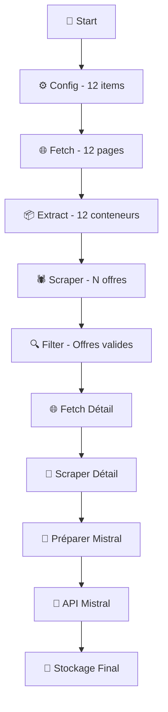

# Workflow HelloWork Scraper - Documentation Technique

## 🎯 Objectif du Workflow

Ce workflow N8N automatise la recherche et l'analyse d'offres d'alternance en cybersécurité sur la plateforme HelloWork. Il combine scraping web, extraction de données et classification IA pour identifier les meilleures opportunités.

## 📋 Fonctionnalités Principales

- **Recherche Multi-Critères** : Génération automatique de requêtes pour différentes combinaisons de mots-clés et lieux
- **Scraping Intelligent** : Extraction des offres avec gestion d'erreurs et retry automatique
- **Enrichissement de Données** : Récupération des détails complets de chaque offre
- **Classification IA** : Validation automatique via Mistral AI selon des critères stricts
- **Filtrage Qualité** : Sélection des offres pertinentes pour un étudiant en Master cybersécurité

## 🔧 Architecture du Workflow

### 1. **🚀 Start** → **⚙️ Config HelloWork**
**Rôle** : Génération des configurations de recherche
```javascript
// Génère 12 configurations (3 lieux × 2 mots-clés × 2 types d'alternance)
const keywords_main = ['cybersécurité', 'reseau et telecom'];
const alternance_types = ['alternance', 'apprentissage'];
const locations = ['Marseille', 'Paris', 'Aix-en-Provence'];
```
**Sortie** : 12 items de configuration distincts

### 2. **🌐 Fetch Page**
**Rôle** : Récupération des pages de résultats HelloWork
- Headers personnalisés (User-Agent, Accept)
- Timeout configuré (30s)
- Gestion d'erreurs avec continuation

### 3. **📦 Extraire Conteneur Offres** ⚠️ **PROBLÈME IDENTIFIÉ**
**Rôle** : Extraction du conteneur HTML contenant les offres
**Problème** : Ne traite qu'un seul item au lieu des 12 configurations

### 4. **🕷️ Scraper Liste Offres**
**Rôle** : Parsing des offres individuelles depuis le HTML
- Sélecteurs multiples pour robustesse
- Extraction : titre, entreprise, lieu, contrat, URL

### 5. **🔍 Filtrer Offres Valides**
**Rôle** : Validation de base (URL + titre non vides)

### 6. **🌐 Fetch Détail Offre** → **📄 Scraper Détail Offre**
**Rôle** : Enrichissement avec détails complets
- Description de missions
- Profil recherché
- Avantages
- Tags résumé

### 7. **🎯 Préparer Mistral** → **🧠 API Mistral**
**Rôle** : Classification IA avec critères stricts
- Validation type de contrat (alternance/apprentissage)
- Vérification domaine cybersécurité/réseau
- Évaluation niveau formation approprié

### 8. **💾 Stocker Offre Finale**
**Rôle** : Consolidation des données avec score final

## 🐛 Diagnostic du Problème

### **Symptôme**
- 12 configurations générées
- Seulement 1 offre traitée dans "Extraire Conteneur Offres"

### **Cause Racine**
Le nœud "📦 Extraire Conteneur Offres" utilise :
```javascript
const config = $('⚙️ Config HelloWork').item.json;
```

Cette syntaxe récupère seulement le **premier item** du nœud Config HelloWork, pas tous les 12 items générés.

### **Solution Recommandée**

#### Option 1 : Modification du Code (Recommandée)
```javascript
// Dans le nœud "📦 Extraire Conteneur Offres"
// Remplacer :
const config = $('⚙️ Config HelloWork').item.json;

// Par :
const config = $('⚙️ Config HelloWork').item(0).json; // Pour le premier
// Ou utiliser l'index approprié selon le contexte
```

#### Option 2 : Restructuration du Workflow
- Ajouter un nœud **Split** après "⚙️ Config HelloWork"
- Garantir que chaque configuration soit traitée individuellement

## 📊 Flux de Données Attendu



## 🔧 Paramètres de Configuration

### Recherche
- **Mots-clés** : `cybersécurité`, `reseau et telecom`
- **Types** : `alternance`, `apprentissage`
- **Lieux** : `Marseille`, `Paris`, `Aix-en-Provence`
- **Contrats** : `apprentissage`, `contrat-professionnalisation`

### Scraping
- **Timeout** : 30 secondes
- **Retry** : 3 tentatives
- **User-Agent** : Chrome 91.0.4472.124

### Classification IA
- **Modèle** : Mistral Large Latest
- **Température** : 0.05 (précision maximale)
- **Critères** : Contrat + Domaine + Niveau + Durée

## 📈 Métriques de Performance

- **Configurations générées** : 12
- **Pages scrapées attendues** : 12
- **Offres moyennes par page** : 10-30
- **Taux de validation IA** : ~20-30%
- **Offres finales attendues** : 30-100

## 🛠️ Actions Correctives Prioritaires

1. **URGENT** : Corriger le nœud "📦 Extraire Conteneur Offres"
2. **Monitoring** : Ajouter logs pour tracking des 12 configurations
3. **Robustesse** : Implémenter gestion d'erreurs par configuration
4. **Optimisation** : Paralléliser les requêtes si possible

## 📝 Logs de Debug Recommandés

```javascript
// Ajouter dans chaque nœud critique
console.log(`[${new Date().toISOString()}] Nœud: ${nom_noeud}`);
console.log(`Items reçus: ${$input.all().length}`);
console.log(`Item actuel: ${JSON.stringify($input.item.json, null, 2)}`);
```

## 🔄 Prochaines Évolutions

- Support d'autres plateformes (Indeed, LinkedIn, etc.)
- Classification multi-modèles (backup si Mistral indisponible)
- Interface de monitoring en temps réel
- Alertes automatiques pour offres haute qualité